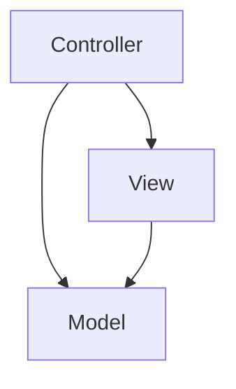

# Smart Snake Game


## Project Overview
Smart Snake Game is a secure, feature-rich offline desktop simulation application that transforms the classic retro game into a smart computational grid. Users can play manually or watch intelligent autonomous solvers (A* Pathfinding and BFS) and trained Machine Learning agents (Q-Learning) play the game with perfect precision. It features a modern neon HUD sidebar dashboard and persistent SQLite database logging for scores, historic matches, and stats.

---

## Features
- **Classic Gameplay**: Traditional grid movement with input buffering and growing snake tail.
- **A\* Pathfinding Autoplay**: Uses Manhattan distance heuristics to find the shortest path to food.
- **BFS Safety Search Fallback**: Safety engine that steers the snake toward its own tail or loops empty space when trapped.
- **Reinforcement Learning Agent**: A Q-learning agent with a compact state space (128 states) training in seconds.
- **Neon HUD Sidebar Dashboard**: Dynamic control widgets, game speed sliders, epsilon parameters, and live path overlays.
- **Relational Scoring Database**: Relational SQLite logging tracking scores, dates, modes, moves, and runtimes.
- **Interactive Leaderboard Dialog**: Detailed scoreboard with options to search, delete rows, clear history, and export to CSV.

---

## Screenshots
*(Add path previews or UI mockups here)*
```text
+-----------------------------------+--------------------+
|                                   |  Mode: [A* Solver] |
|              ( Snake )            |                    |
|                o-o-o              |  Score: 32         |
|                    o-o            |  High: 84          |
|                      o            |  Steps: 218        |
|                           [Food]  |                    |
|                                   |  [Leaderboard]     |
|                                   |  [Speed Slider]=== |
+-----------------------------------+--------------------+
```

---

## Architecture
This project follows a strict **Model-View-Controller (MVC)** pattern:
* **Model**: Tracks grid occupancy, snake coordinates, current directions, dynamic obstacles, and score statistics.
* **View**: Renders grid lines, neon borders, trailing tail gradients, and path overlay routes.
* **Controller**: Drives game loops, monitors user keystrokes, triggers autoplay agents, and updates metrics in the dashboard.



---

## Technology Stack
- **Core Platform**: Java 21 (OpenJDK)
- **GUI Framework**: Java Swing & AWT
- **Database Engine**: SQLite 3 (via local JDBC driver)
- **Design Paradigm**: Model-View-Controller (MVC)
- **Build Utilities**: PowerShell script, GNU Make, Apache Ant

---

## Requirements
- **Runtime Environment**: Java Development Kit (JDK) 21 or higher.
- **Operating System**: Windows, Linux, or macOS.
- **Database Driver**: SQLite JDBC (pre-packaged in `lib/`).

---

## Installation
1. Clone the repository locally:
   ```bash
   git clone https://github.com/SufiyanAasim/smart-snake-game.git
   ```
2. Navigate to the project directory:
   ```bash
   cd smart-snake-game
   ```

---

## Quick Start
To compile and run the application instantly on Windows, open a PowerShell terminal and run:
```powershell
./build_and_run.ps1
```

---

## Configuration
Game settings such as default width, height, and game speeds are configured in `nbproject/project.properties` and the `.env` settings file.

---

## Environment Variables
The application reads from `.env` at boot. Standard parameters:

| Variable | Required | Default | Description |
| --- | --- | --- | --- |
| `APP_ENV` | No | `development` | Environment mode (`development` or `production`). |
| `DB_PATH` | Yes | `data/scores.db` | Directory path pointing to the SQLite database file. |
| `GAME_WIDTH` | No | `800` | Grid play area width in pixels. |
| `GAME_HEIGHT` | No | `600` | Grid play area height in pixels. |
| `PLAYER_NAME` | No | `Guest` | Default active player login name. |

---

## Running Locally
Compile and package the runnable JAR using:
```powershell
# Using powershell wrapper
./build_and_run.ps1

# Using Makefile
make
make run
```
The executable is generated at `dist/SmartSnakeGame.jar`.

---

## Docker
1. Build the Docker image containing JDK 21 compilation:
   ```bash
   docker build -t smart-snake-game .
   ```
2. Run the container:
   ```bash
   docker-compose up
   ```
   *(Note: Display forwarding configuration is required to render the GUI).*

---

## Cloud Deployment
As an offline desktop client, cloud deployments are not natively supported. Remote scoring endpoints can be integrated in future phases.

---

## API Documentation
There are no external REST APIs. See code structure guides in [docs/Developer Guide.md](file:///d:/Completed%20Github%20Projects%20%28Fully%20Tested%20&%20Deployed%29/docs/Developer%20Guide.md) for internal Java class signatures.

---

## Project Structure
```text
Smart Snake Game/
├── .github/                # Bug, PR templates, and CI workflows
├── docs/                   # Relevant documentation guides
├── src/project/            # Source package (Java Swing classes)
├── lib/                    # Pre-packaged JAR dependencies (SQLite JDBC)
├── tests/                  # Local testing verification scripts
├── dist/                   # Compiled standalone runnable JAR
└── build_and_run.ps1       # Automated build compiler script
```

---

## Testing
Unit and visual loop tests are stored under `/tests`. To execute manual tests:
1. Run `./build_and_run.ps1`
2. Test controller modes (Keyboard, A*, Q-Learning) in the UI sidebar.

---

## Performance
- **Pathfinding**: $O(V + E)$ where $V = 1200$ (grid size). Calculates path in < 1ms on average.
- **Q-Learning**: Compact state tables process 10,000 games in under 3 seconds during headless training.

---

## Security
- **Data Privacy**: Local database file execution with parameterized statements preventing SQL injection.
- **Input Sanitization**: Score names are validated against regex parameters.

---

## Contributing
Please read [CONTRIBUTING.md](file:///d:/Completed%20Github%20Projects%20%28Fully%20Tested%20&%20Deployed%29/Smart%20Snake%20Game/CONTRIBUTING.md) for details on branch naming formats, Conventional Commit styles, and testing processes.

---

## Roadmap
For the full interactive timeline, refer to [ROADMAP.md](file:///d:/Completed%20Github%20Projects%20%28Fully%20Tested%20&%20Deployed%29/Smart%20Snake%20Game/ROADMAP.md).
- **v1.0.0**: Classic base.
- **v2.0.0**: AI solvers.
- **v3.0.0**: Neon dashboard.
- **v4.0.0**: persistent scores.

---

## FAQ
**Q: Can I load custom Q-tables?**  
A: Yes, the agent persistent weights are loaded from `q_table.txt`.

**Q: Game doesn't compile on my machine?**  
A: Check that JDK 21 bin folder is on your system path.

---

## Troubleshooting
Refer to the detailed guide in [docs/Troubleshooting.md](file:///d:/Completed%20Github%20Projects%20%28Fully%20Tested%20&%20Deployed%29/Smart%20Snake%20Game/docs/Troubleshooting.md).

---

## License
Distributed under the MIT License. See [LICENSE](file:///d:/Completed%20Github%20Projects%20%28Fully%20Tested%20&%20Deployed%29/Smart%20Snake%20Game/LICENSE) for more details.

---

## Acknowledgements
- Modern Swing UI guides.
- Reinforcement learning state reductions research.

---

## Support
Open a GitHub issue or contact Mohammad Sufiyan Aasim at support@sufiyanaasim.com.
