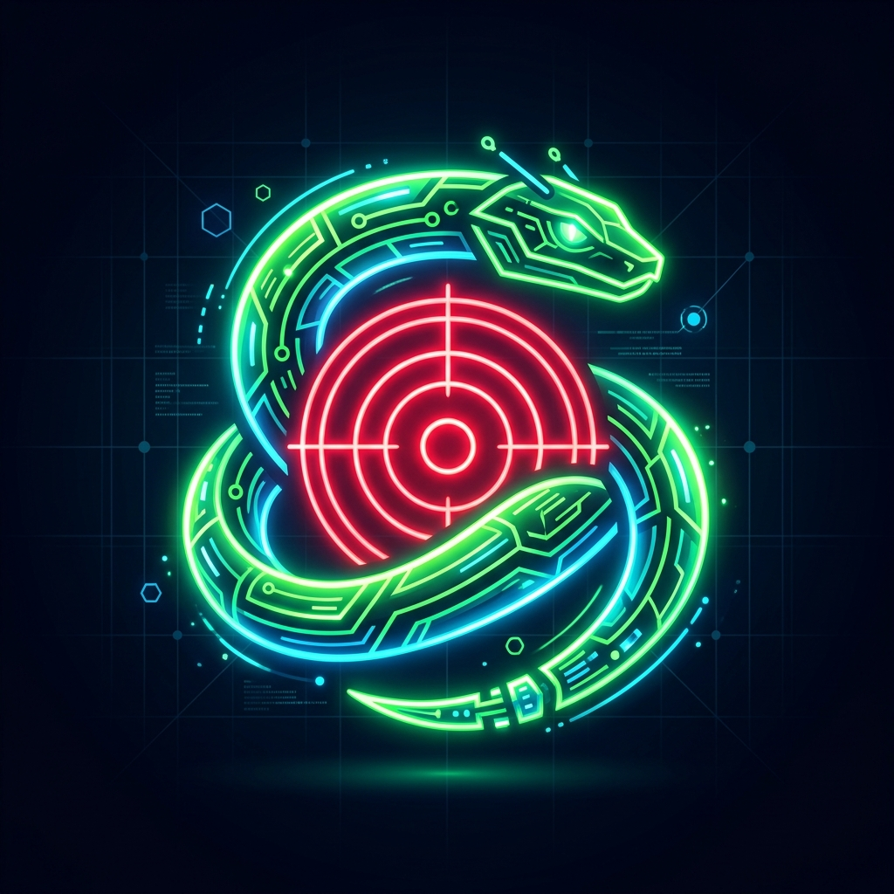

<div align="center">



# Smart Snake

**A Java desktop AI snake game with autonomous pathfinding, reinforcement learning, and a neon dashboard**

[](docs/guides/Developer%20Guide.md)
[](docs/releases/v7.0.0.md)
[](LICENSE)
[]()
[]()
[](CONTRIBUTING.md)

Play manually or watch A\*, BFS, and Q-Learning agents compete live — all offline, no installer, no accounts.

[**Download .exe**](docs/releases/v7.0.0.md) · [**Changelog**](CHANGELOG.md) · [**Roadmap**](ROADMAP.md) · [**Report a Bug**](.github/ISSUE_TEMPLATE/bug_report.md)

</div>

---

## ✨ Features

### 🧠 Autonomous AI Solvers
- **A\* Pathfinder Autoplay** — Manhattan-distance heuristic finds the shortest path to food every tick
- **BFS Safety Fallback** — steers toward the snake's own tail when A\* has no reachable route
- **Q-Learning Agent** — compact 128-state reinforcement learning table that trains to completion in seconds; weights persisted to `q_table.txt`

### 🎮 Manual & Hybrid Controls
- Keyboard arrow-key gameplay with directional input buffering preventing self-collision
- Switch between Manual, A\*, and Q-Learning mid-session from the sidebar — no restart needed

### 📊 Neon HUD Sidebar Dashboard
- Live metrics: Score, High Score, Steps, A\* Path Length, Path Efficiency Index, Q-Agent State Vector
- Speed slider (1×–5×), epsilon (exploration) slider, A\* path-overlay toggle, Visual Theme selector, Border Physics selector

### 🏆 Relational Scoring Database
- SQLite score log tracking Name, Score, High Score, Mode, Steps, and Date
- Interactive Leaderboard dialog with name search, row deletion, full wipe, and CSV export

### ⚔️ Rival Competitor AI (v7.0.0)
- Spawns an autonomous enemy snake that runs its own A\* + BFS engine, hunts food, and actively blocks the player
- Hitting the rival's body triggers immediate Game Over

### 🎵 Arcade Synth Audio Engine
- Programmatic MIDI chiptune sounds — eat blips, shield pops, button hovers, and death crashes
- Zero external audio dependencies; toggle with the sidebar checkbox

### 🌈 Visual Themes & Power-ups
- Three real-time rendering stylesheets: **Cyberpunk Neon**, **Vaporwave Pink**, **Matrix Green**
- **Golden Apple** — rare 10 % spawn, grows snake by 2 extra nodes (+3 points)
- **Shield Orb** — 5 % spawn, absorbs the next collision and shatters the obstacle

### 🗺️ Map Creator & Obstacle Painter
- Enable "Map Obstacle Editor Mode" to pause gameplay and draw custom wall layouts by clicking or dragging on the grid

### 🌀 Toroidal Border Physics
- Toggle between **Solid Borders** (death on contact) and **Wrap Borders** (portal teleportation)
- Both A\* heuristics and Q-Learning sensors are fully portal-aware

---

## 🏗️ Architecture

```
┌─────────────────────────────────────────────────────────────┐
│                    Project.java  (JFrame)                    │
│   Sidebar HUD  ·  Button Panel  ·  Key Bindings  ·  Dialogs │
└────────┬───────────────┬──────────────────┬─────────────────┘
         │               │                  │
         ▼               ▼                  ▼
   GameModel.java   GameView.java   GameController.java
   (State & Data)  (Swing Canvas)  (Timer · AI · Physics)
                                          │
                    ┌─────────────────────┼────────────────┐
                    ▼                     ▼                ▼
             Pathfinder.java    QLearningAgent.java   SoundManager.java
             (A* · BFS)         (128-state Q-table)   (MIDI Synth)
                                                           │
                                                           ▼
                                                  DatabaseManager.java
                                                  (SQLite · JDBC)
```

Full breakdown in [docs/architecture/Architecture.md](docs/architecture/Architecture.md).

---

## 🛠️ Technology Stack

| Layer | Technology |
|-------|-----------|
| Language | Java 21 (OpenJDK) |
| GUI Framework | Java Swing & AWT |
| Game Loop | `javax.swing.Timer` |
| AI Pathfinding | A\* (Manhattan heuristic) + BFS safety |
| Machine Learning | Tabular Q-Learning (128 states, ε-greedy) |
| Audio Synthesis | `javax.sound.midi` (MIDI square-wave synth) |
| Database | SQLite 3 via pre-bundled `sqlite-jdbc.jar` |
| Architecture | Model-View-Controller (MVC) |
| Build | PowerShell script · GNU Make · Apache Ant |
| Launcher | C# .NET 10 single-file `.exe` with embedded icon |

### Bundled dependencies (`lib/`)

| JAR | Purpose |
|-----|---------|
| `sqlite-jdbc.jar` | SQLite JDBC driver — relational score persistence |
| `slf4j-api.jar` | SLF4J logging API |
| `slf4j-simple.jar` | SLF4J simple logger implementation |

---

## 🚀 Getting Started

### Requirements
- Windows OS
- Java Development Kit (JDK) 21 or higher

### Quick launch
Double-click **`SmartSnake.exe`** in the repository root — no installation required.

### Clone and build from source

```bash
git clone https://github.com/SufiyanAasim/smart-snake.git
cd smart-snake
```

```powershell
# Compile, package, and run in one step
./build_and_run.ps1
```

Or step-by-step:

```powershell
javac -cp "lib/sqlite-jdbc.jar;lib/slf4j-api.jar;lib/slf4j-simple.jar" -d out src/project/*.java
jar --create --file dist/SmartSnake.jar --main-class project.Project -C out project
java -cp "dist/SmartSnake.jar;lib/sqlite-jdbc.jar;lib/slf4j-api.jar;lib/slf4j-simple.jar" project.Project
```

Full setup details in [docs/guides/Developer Guide.md](docs/guides/Developer%20Guide.md).

---

## ⚙️ Configuration

The application reads optional settings from `.env` at boot:

| Variable | Default | Description |
|----------|---------|-------------|
| `DB_PATH` | `data/scores.db` | Path to the SQLite score database |
| `GAME_WIDTH` | `800` | Play area width in pixels |
| `GAME_HEIGHT` | `600` | Play area height in pixels |
| `PLAYER_NAME` | `Guest` | Default player name pre-filled on game-over |
| `APP_ENV` | `development` | Environment mode |

Copy `.env.example` to `.env` and adjust as needed.

---

## 🗂️ Project Structure

```
smart-snake/
├── .github/                # Issue/PR templates and CI configuration
├── assets/                 # Logo and icon assets
├── docs/
│   ├── architecture/       # System architecture documentation
│   ├── guides/             # Developer and user guides
│   ├── releases/           # Per-version release notes (v1–v7)
│   └── troubleshooting/    # Common issues and fixes
├── lib/                    # Bundled JAR dependencies
├── src/project/            # Java MVC source package
│   ├── Project.java            # Main JFrame · sidebar · key bindings
│   ├── GameModel.java          # State: snake, food, score, flags
│   ├── GameView.java           # Swing canvas renderer
│   ├── GameController.java     # Timer · AI steering · collision
│   ├── Pathfinder.java         # A* + BFS pathfinding engine
│   ├── QLearningAgent.java     # 128-state Q-learning agent
│   ├── SoundManager.java       # MIDI chiptune synthesizer
│   ├── DatabaseManager.java    # SQLite score persistence
│   ├── LeaderboardDialog.java  # Score browser dialog
│   ├── CreditsDialog.java      # Credits overlay
│   ├── HelpDialog.java         # Controls help dialog
│   └── NameInputDialog.java    # Game-over name entry
├── src_launcher/           # C# .NET launcher source (embeds icon)
├── dist/                   # Compiled SmartSnake.jar output
├── CHANGELOG.md
├── CONTRIBUTING.md
├── LICENSE
├── README.md
├── RELEASE.md
├── ROADMAP.md
├── SmartSnake.exe          # Native Windows launcher
└── build_and_run.ps1       # One-command build & run script
```

---

## 🧪 Testing

There is no automated test suite yet — all modes are validated manually after each change.

Manual validation checklist:
1. Start a game and confirm the Pause button switches to **Resume** when pressed.
2. Press Resume and confirm the button returns to **Pause** and speed is unchanged.
3. Open Leaderboard, Help, or Credits while the game is running — confirm auto-pause.
4. Click **Exit** and confirm the application closes cleanly.
5. Enable Rival AI and confirm collision with the enemy triggers Game Over.
6. Toggle all three Visual Themes mid-game.
7. Switch Border Physics from Solid to Wrap and confirm the snake teleports.

---

## 🛡️ Security

Fully offline, single-user desktop application — no network calls, no accounts, no cloud. The only persisted state is a local SQLite score database and `q_table.txt`. All database queries use parameterized statements to prevent SQL injection. See [SECURITY.md](SECURITY.md) to report a vulnerability.

---

## 🤝 Contributors

<table>
  <tr>
    <td align="center">
      <a href="https://github.com/SufiyanAasim">
        <br/>
        <sub><b>Mohammad Sufiyan Aasim</b></sub>
      </a><br/>
      <sub>System Architect · AI/ML · Build & Release</sub>
    </td>
    <td align="center">
      <a href="https://github.com/FahadBinNasir">
        <br/>
        <sub><b>Fahad Bin Nasir</b></sub>
      </a><br/>
      <sub>UI Controls · Layout · Testing</sub>
    </td>
  </tr>
</table>

See [CONTRIBUTING.md](CONTRIBUTING.md) to get involved.

---

## 📄 License

[MIT License](LICENSE) © 2026 Smart Snake Contributors.

---

<div align="center">

⭐ **Star this repo if you enjoyed watching the AI play.**

[Report Bug](.github/ISSUE_TEMPLATE/bug_report.md) · [Request Feature](.github/ISSUE_TEMPLATE/feature_request.md) · [Changelog](CHANGELOG.md)

</div>
