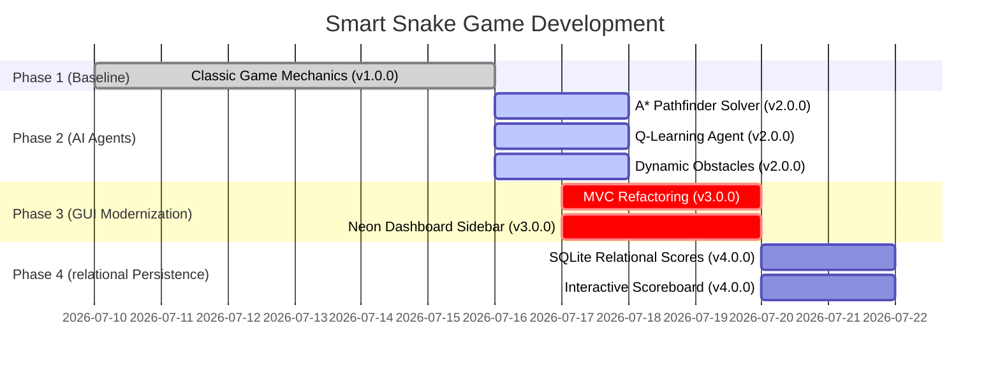

# Smart Snake Game Roadmap

This roadmap tracks the development progress of the Smart Snake Game application:

## Release Summary
* **v1.0.0 (`retroserpent`)**: Establish baseline play, controls, and local packaging.
* **v2.0.0 (`cyberserpent`)**: Integrate perfect-play A* graph search and compact reinforcement learning agent.
* **v3.0.0 (`synthserpent`)**: Modernize visual rendering layout and implement real-time dashboards.
* **v4.0.0 (`vaultserpent`)**: Persistent relational scoreboard logging and interactive statistics panels.
