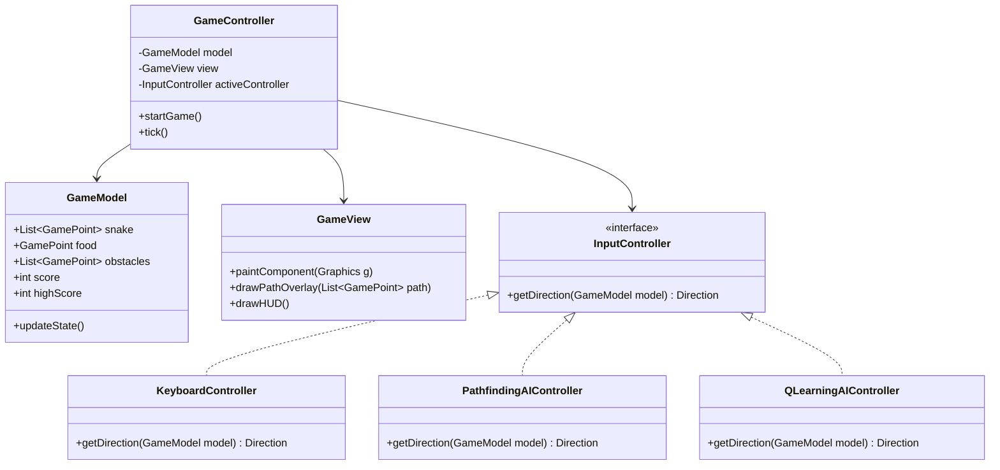

# Release & Architecture Document - v2.0.0
# Release Name: "CyberSerpent: AI Evolution"

**Target Release Version**: v2.0.0  
**Development Target**: Java 21 (JDK 21)

---

## 1. Vision & Overview

**"CyberSerpent: AI Evolution" (v2.0.0)** elevates the classic, manual snake game into an intelligent, multi-mode simulation platform. This release introduces advanced computational algorithms (pathfinding and heuristic searching), machine learning (Q-Learning reinforcement learning), and dynamic environment mechanics, providing an interactive showcase of human vs. machine capabilities.

---

## 2. Key Smart Features

### A. Autonomous Solver Suite (A* & BFS Pathfinding)
To make the snake play autonomously with perfect precision, we introduce a graph-search controller:
- **A\* Pathfinding Algorithm**:
  - **Nodes**: Represented by the grid cells ($40 \times 30$).
  - **Obstacles**: Defined dynamically by the current coordinate list of the snake body and boundaries.
  - **Heuristic**: Manhattan distance to the food point:
    $$h(n) = |x_1 - x_2| + |y_1 - y_2|$$
  - **Path Selection**: Identifies the shortest safe path from the snake's head to the food.
- **BFS (Breadth-First Search) Fallback**:
  - In cases where the snake is extremely long or blocked from reaching the food, A* may fail to find a path.
  - The agent falls back to a BFS-based safety algorithm. The BFS searches for the path to the snake's own tail (since the tail is guaranteed to move on the next tick). This allows the snake to "stall" safely, wrapping around itself until a path to the food opens.

---

### B. Machine Learning Agent (Q-Learning Reinforcement Learning)
For a model that *learns* to play from experience, we implement an on-device Q-Learning agent:
- **State Representation**: A reduced state vector representing relative coordinates and immediate threats:
  - **Surrounding Danger**: 3 boolean flags (Danger Straight, Danger Left, Danger Right) relative to current heading.
  - **Food Direction**: 4 boolean flags (Food Up, Food Down, Food Left, Food Right) relative to head position.
  - **Heading Direction**: Current direction vector.
- **Action Space**:
  - `[0: Go Straight, 1: Turn Left, 2: Turn Right]`.
- **Reward Policy**:
  - Consuming food: `+10`
  - Collision (Game Over): `-100`
  - Step towards food: `+1`
  - Step away from food: `-1.5`
- **Training Mode**:
  - Runs the game engine at zero-delay speed (thousands of games per minute) to build the Q-Table.
  - Saves the learned Q-values to a local file (`q_table.json` or `.txt`) for persistent memory.
- **Autoplay Mode**:
  - Loads the pre-trained Q-table and controls the snake in real-time, displaying its learned behavior.

---

### C. Dynamic Environment & Smart Hazards
To challenge both human players and AI agents:
- **Dynamic Obstacles**: Spawns static barriers or moving blocks as the score increases, forcing A* and Q-learning models to re-route dynamically.
- **Smarter Food Spawning**: Ensures food doesn't spawn in closed pockets or corners where the snake is trapped, utilizing connectivity analysis (e.g. flood-fill check) before spawning.
- **Progressive Difficulty**: Gradually increases the game speed (decreasing timer interval) to test system latency and algorithm execution times.

---

## 3. UI & Control Dashboard Upgrades

To support these modes, the GUI layout is expanded to include a side-dock control dashboard:

1. **Controller Toggle**:
   - `[Manual Play]` (Default Keyboard Arrow Controls)
   - `[A* Pathfinding Autoplay]` (Perfect Graph Search Solver)
   - `[Q-Learning Demo]` (Model-Free Reinforcement Learning)
2. **AI Metric Displays**:
   - **Active State Vector**: Shows what the Q-agent currently senses.
   - **Pathfinding Overlay**: Draw a light dotted path on the grid representing the path A* has planned to the food.
   - **Steps Count / Efficiency Index**: Tracks path length versus optimal path length.
   - **Epsilon ($\epsilon$) Slider**: Adjusts exploration vs. exploitation during active Q-Learning demos.

---

## 4. Architectural Implementation Strategy

To cleanly inject these features without breaking the core engine, the codebase is refactored from a monolithic JPanel into a clean Model-View-Controller (MVC) structure:

This decoupled architecture ensures that swapping between manual play, pathfinding AI, and machine learning models is as simple as switching the active implementation of the `InputController` interface in the `GameController` runtime loop.
