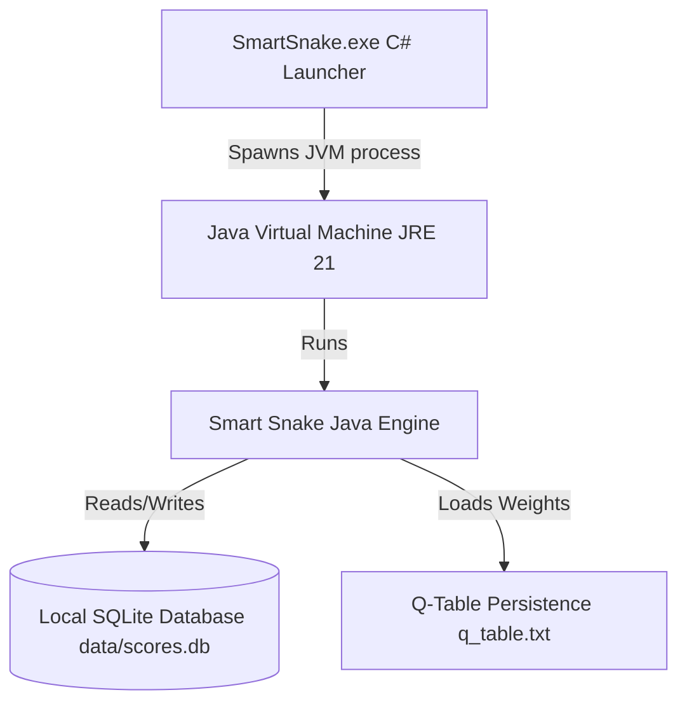
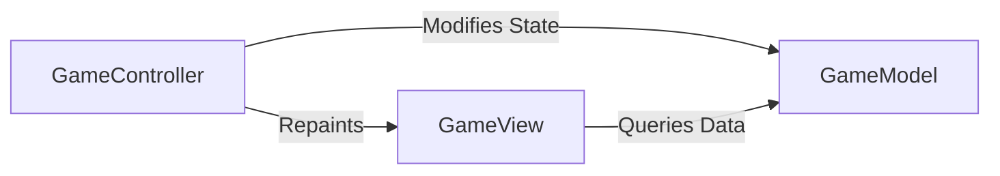

# 🏛️ Smart Snake - Architecture & Systems Design

This document details the architectural layout, package collaborations, and system integrations of the Smart Snake suite.

---

## 1. System Overview
Smart Snake is structured as a dual-language application consisting of a **Core Java 21 Swing game engine** and a **Native Windows C# Bootstrap Launcher**.

---

## 2. Java Core Architecture: Model-View-Controller (MVC)
The Java codebase is divided into decoupled packages following the MVC design pattern for improved maintainability:

### 1. Model (`GameModel.java`)
Manages structural data states and business variables without any GUI components:
* Coordinates of the snake nodes (using `GamePoint` structures).
* Food location, food type (Normal, Golden, Shield), and active list of dynamic obstacles.
* Player scores, high scores, moves count, active AI modes, and path arrays.
* **Border Mode State**: Toggle between `"Solid"` (death on border collision) and `"Wrap"` (portal wrap-around teleportation).
* **Rival Competitor State**: Tracks the enemy snake coordinates and directions.
* **Map Editor State**: Flag controlling active level creation/obstacle painting.
* **Theme Selection**: Tracks active visual stylesheet theme (Cyberpunk, Vaporwave, Matrix).

### 2. View (`GameView.java`)
Manages graphics rendering using Java AWT/Swing:
* Extends `JPanel` to draw grid layers.
* **Render-to-Texture Scaling**: Draws all elements onto a fixed `800x600` `BufferedImage` first, and then paints the scaled image to fit the panel bounds, preserving the 4:3 aspect ratio with centering and letterboxing.
* Paints the snake gradient tail, glowing target food, dynamic barriers, and translucent A* path overlays.
* **Themes Styling**: Resolves rendering colors dynamically based on the model's active stylesheet.
* **Map Editor Mouse Mapping**: Captures drag and click events, maps coordinates to 800x600 coordinates, and paints custom walls.

### 3. Controller (`GameController.java`)
Coordinates the application timeline and user inputs:
* Schedules Swing `Timer` loops mapping delay ticks (from 100ms down to 20ms).
* Delegates keyboard actions to manual direction changes and captures `F11` for fullscreen toggles.
* **Toroidal Coordinate Translation**: Wraps the snake's head coordinate when exiting boundaries under Wrap mode.
* Evaluates path updates from `Pathfinder` or Q-learning predictions on each clock tick.
* **Rival Competitor AI**: Computes the rival AI snake path and tick movements in parallel.
* **Sound Synthesis Manager** (`SoundManager.java`): Drives native MIDI chiptunes and audio effects (eating, button hover, shield break, crash).

---

## 3. Computational AI Solvers
The game features two distinct autonomous decision-making engines:

### 1. A* Pathfinder & BFS Safety (`Pathfinder.java`)
* **A\* Search**: Calculates the shortest coordinate route from head to food using Manhattan distance heuristics.
* **BFS Safety Routing**: When no direct path to food exists, a Breadth-First Search (BFS) scanner calculates fallback survival moves aiming for the snake's own tail or maximum open grid coordinates.
* **Toroidal Wrapping Calculations**: Under Wrap Mode, the Manhattan heuristic and neighbor calculations resolve paths through the screen borders, using `dx_wrapped = Math.min(dx, width - dx)`.

### 2. Q-Learning Reinforcement Learning (`QLearningAgent.java`)
* **State Vector**: Encodes 128 discrete states using binary bits for directional danger and relative food quadrants.
* **Wrapped Observations**: Adapts danger sensor detection and relative food quadrants using wrapped coordinate math under Wrap Mode.

---

## 4. Database Persistence System (`DatabaseManager.java`)
* **SQLite JDBC**: Binds connections locally (`data/scores.db`) using `lib/sqlite-jdbc.jar`.
* **Scoreboard Dialog** (`LeaderboardDialog.java`): Renders score logs, filters rows dynamically, allows deleting records, and exports scores as CSV text files.
* **Name Input Dialog** (`NameInputDialog.java`): Custom dark-themed modal overlay matching the neon aesthetic to prompt for the player's name on Game Over.

---

## 5. Native Windows C# Launcher (`SmartSnake.exe`)
To make Java executable natively on Windows with customized presentation:
* **C# Bootstrapper**: Built from `src_launcher/Program.cs` and compiled with .NET SDK.
* **Hiding Consoles**: Launches Java via `javaw.exe` (instead of `java.exe`) which hides command prompts.
* **Active Folder Context**: Configures `WorkingDirectory` explicitly to the launcher's folder directory so that relative classpath targets resolve correctly.
