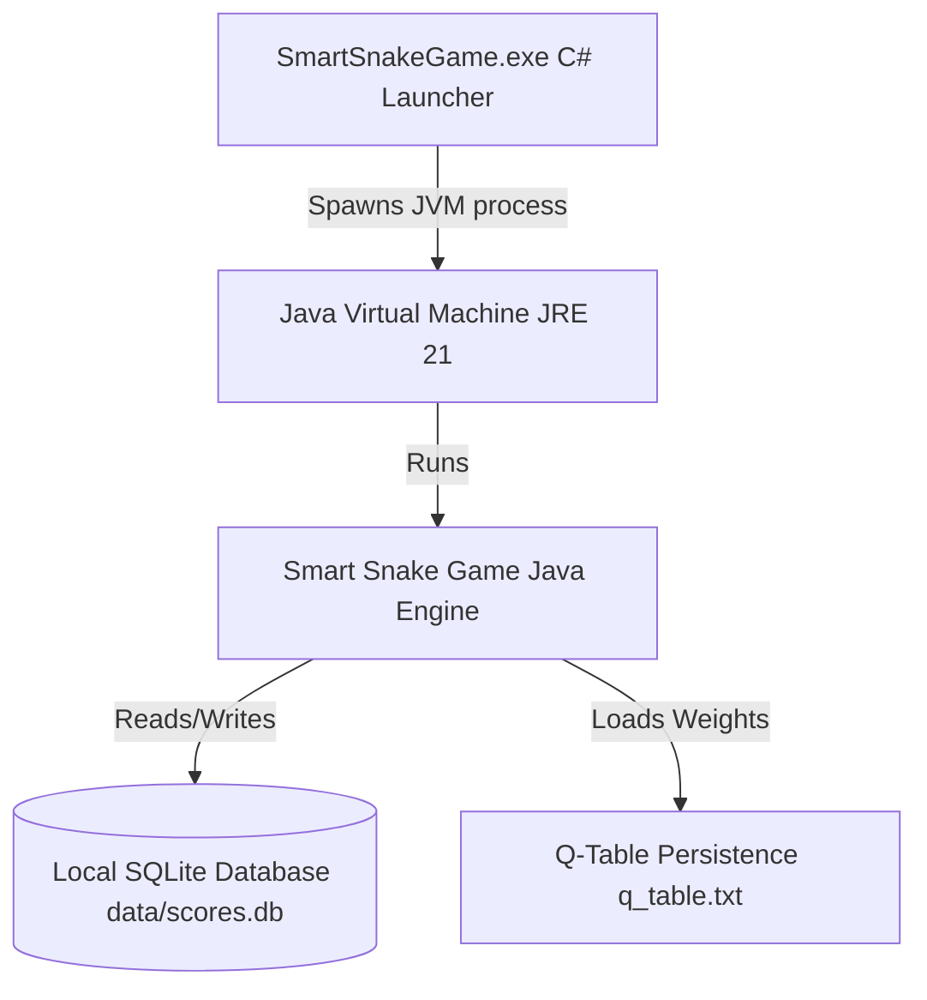
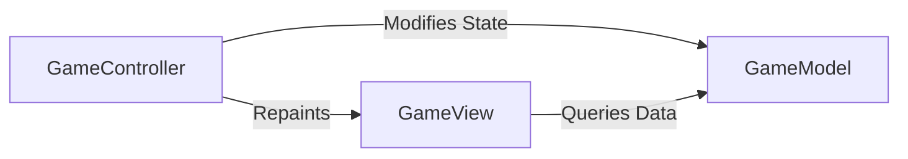

# 🏛️ Smart Snake Game - Architecture & Systems Design

This document details the architectural layout, package collaborations, and system integrations of the Smart Snake Game suite.

---

## 1. System Overview
Smart Snake Game is structured as a dual-language application consisting of a **Core Java 21 Swing game engine** and a **Native Windows C# Bootstrap Launcher**.

---

## 2. Java Core Architecture: Model-View-Controller (MVC)
The Java codebase is divided into decoupled packages following the MVC design pattern for improved maintainability:

### 1. Model (`GameModel.java`)
Manages structural data states and business variables without any GUI components:
* Coordinates of the snake nodes (using `GamePoint` structures).
* Food location and active list of dynamic obstacles.
* Player scores, high scores, steps count, active AI modes, and path arrays.

### 2. View (`GameView.java`)
Manages graphics rendering using Java AWT/Swing:
* Extends `JPanel` to draw grid layers.
* Paints the snake gradient tail, glowing target food, dynamic barriers, and translucent A* path overlays.
* Renders the game title logo (`assets/logo.png`) centered on start and Game Over overlay screens.

### 3. Controller (`GameController.java`)
Coordinates the application timeline and user inputs:
* Schedules Swing `Timer` loops mapping delay ticks (from 100ms down to 20ms).
* Delegates keyboard actions to manual direction changes.
* Evaluates path updates from `Pathfinder` or Q-learning predictions on each clock tick.
* Implements the headless reinforcement training loop.
* Updates the live sidebar panel metrics using `HUDUpdateCallback` interfaces.

---

## 3. Computational AI Solvers
The game features two distinct autonomous decision-making engines:

### 1. A* Pathfinder & BFS Safety (`Pathfinder.java`)
* **A\* Search**: Calculates the shortest coordinate route from head to food using Manhattan distance heuristics.
* **BFS Safety Routing**: When no direct path to food exists (due to trapping loops or obstacles), a Breadth-First Search (BFS) scanner calculates fallback survival moves aiming for the snake's own tail or maximum open grid coordinates.

### 2. Q-Learning Reinforcement Learning (`QLearningAgent.java`)
* **State Vector**: Encodes 128 discrete states using binary bits for:
  * Directional danger (Danger Left, Danger Front, Danger Right).
  * Food relative direction (quadrant coordinates relative to head).
* **Q-Table Model**: Stores policy weights inside a local text ledger (`q_table.txt`). Exposes a headless compiler simulating thousands of training loops in seconds.

---

## 4. Database Persistence System (`DatabaseManager.java`)
* **SQLite JDBC**: Binds connections locally (`data/scores.db`) using `lib/sqlite-jdbc.jar`.
* **SLF4J Logging**: Integrates `lib/slf4j-api.jar` and `lib/slf4j-simple.jar` console frameworks.
* **Scoreboard Dialog** (`LeaderboardDialog.java`): Renders score logs, filters rows dynamically, allows deleting records, and exports scores as CSV text files.

---

## 5. Native Windows C# Launcher (`SmartSnakeGame.exe`)
To make Java executable natively on Windows with customized presentation:
* **C# Bootstrapper**: Built from `src_launcher/Program.cs` and compiled with .NET SDK.
* **Hiding Consoles**: Launches Java via `javaw.exe` (instead of `java.exe`) which hides command prompts.
* **Embedded Icon**: Links `assets/logo.ico` within its properties so it displays the glowing game logo in Windows Explorer.
